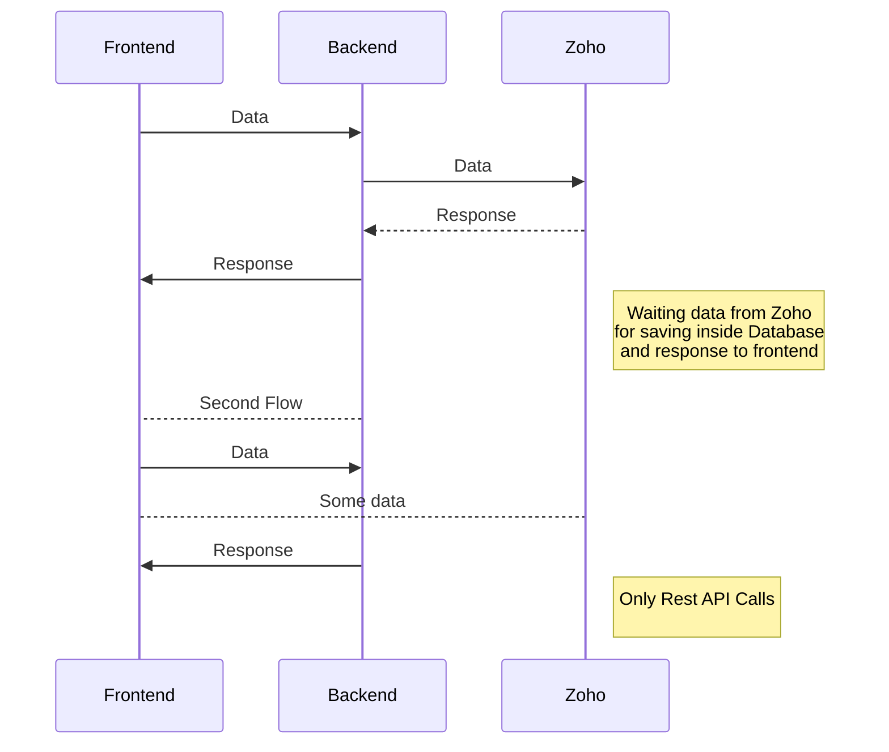
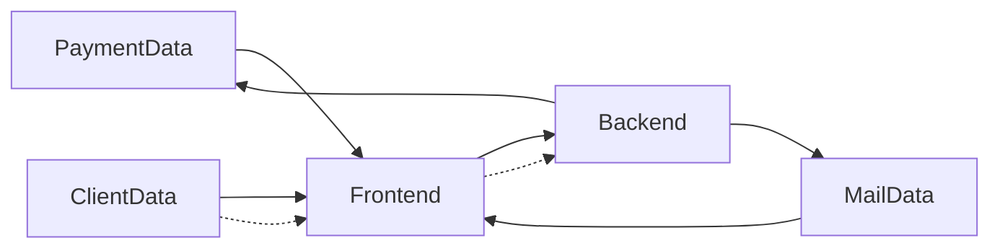
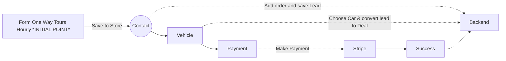
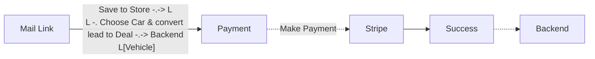
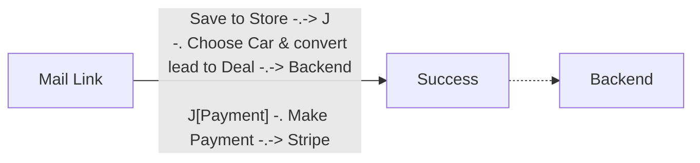
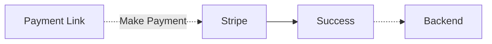

<p align="center"><a href="https://booking.deluxelimoitaly.com/" target="_blank"></a></p>  


## About DLI Frontend (Monorepo)


## Install
### Deploy Locally
1. Look and Deploy DLI Backend
2. Install Node.js <= 18
3. cd repo
4. Prepare .env variables for develop (copy .env.example -> .env)
5. touch .env.sentry-build-plugin
6.`npm install`
7.`npm run dev`


### Configure Developing
#### Php Storm
1. File -> Settings -> Editor -> Inspections -> Profreading (Typo) - Uncheck


## Contributing
1. Read [GitFlow](https://www.atlassian.com/ru/git/tutorials/comparing-workflows/gitflow-workflow)
2. Create new branch like feature/* or hotfix/*
3. Develop
4. Commit
5. Repeat before finish functionality
6. Push to branch
7. Make MR to dev branch

## UnderStanding Flow

We are use package for oneWay integrate to **zoho** and collect data about Leads, Deals, Contact:
This is a repository of tree different visual projects. 
For see the difference you need to go Install section on step 5 
and put into .env.sentry-build-plugin 
```dotenv
SENTRY_AUTH_TOKEN="cdb5449a36f9fe79341210fdb0434d9a4e8a69357461e9c2f1cf779c49500aba"
SENTRY_PROJECT="booking-platform-dli-frontend"
VITE_PROJECT_ALIAS=dli
```

VITE_PROJECT_ALIAS is a variable to check project name wich (dli, dgt, rlt)



# Frontend Flow:


## Legend

**Payment data** - this is a generated link by stripe for some service of company registered like an order. For stripe it will be like an registered and added product. (more on backend side)
**Mail Data** - this is a generated link by zoho for decide users to finish order with discount, named **mail_car** link

**Client Data** - this is a data of forms filled directly inside an application
_____


# Deep Inside
### Client Data Flow


### Mail Data Flow
When recognize a mail link process keep in mind for that flow order created and has inside a backend database and zoho **BUT** not have a deal


### Mail Data Flow (With Car)
When recognize a mail car process keep in mind for that flow order created and has inside a backend database and zoho - that will be converted when user follow by that link


### Payment Data Flow
Payment Data flow start on a point from email link - but that link generated by backend and zoho for [stripe link](https://stripe.com/docs/api/payment_links/payment_links/retrieve) (

For client data-flow you can find handlers inside a components
For mail data-flow (with car or without car) inside a src/router/router.js
For payment data-flow you can find handler inside Success.vue component
